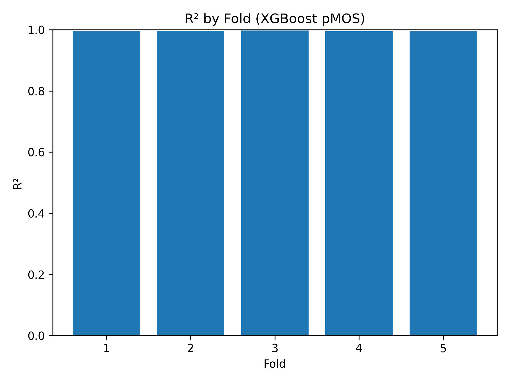
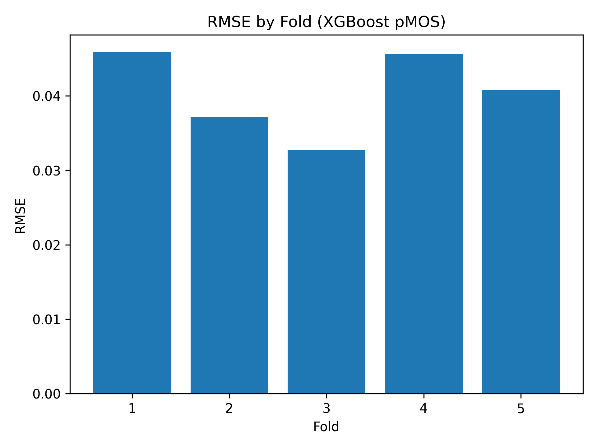
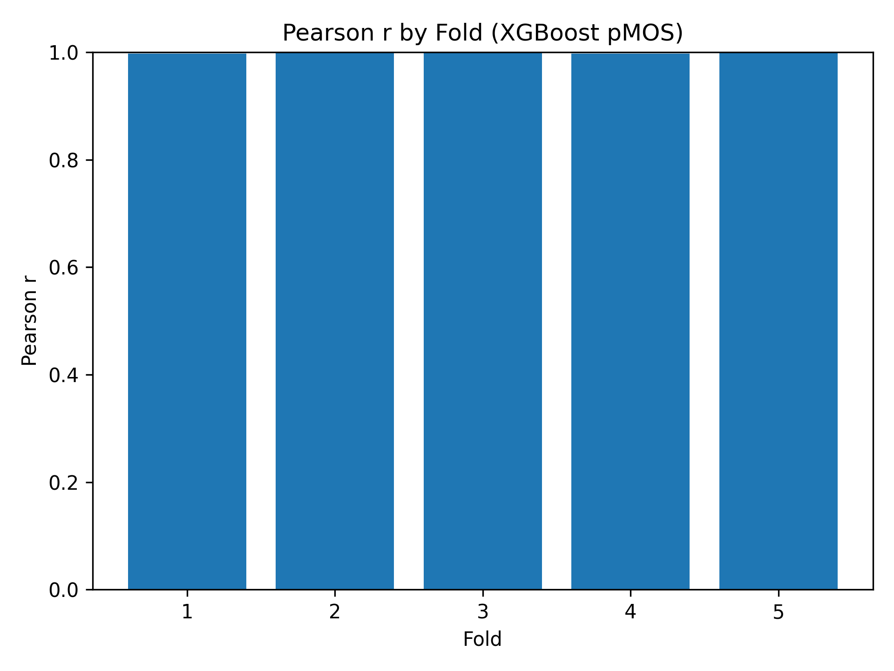
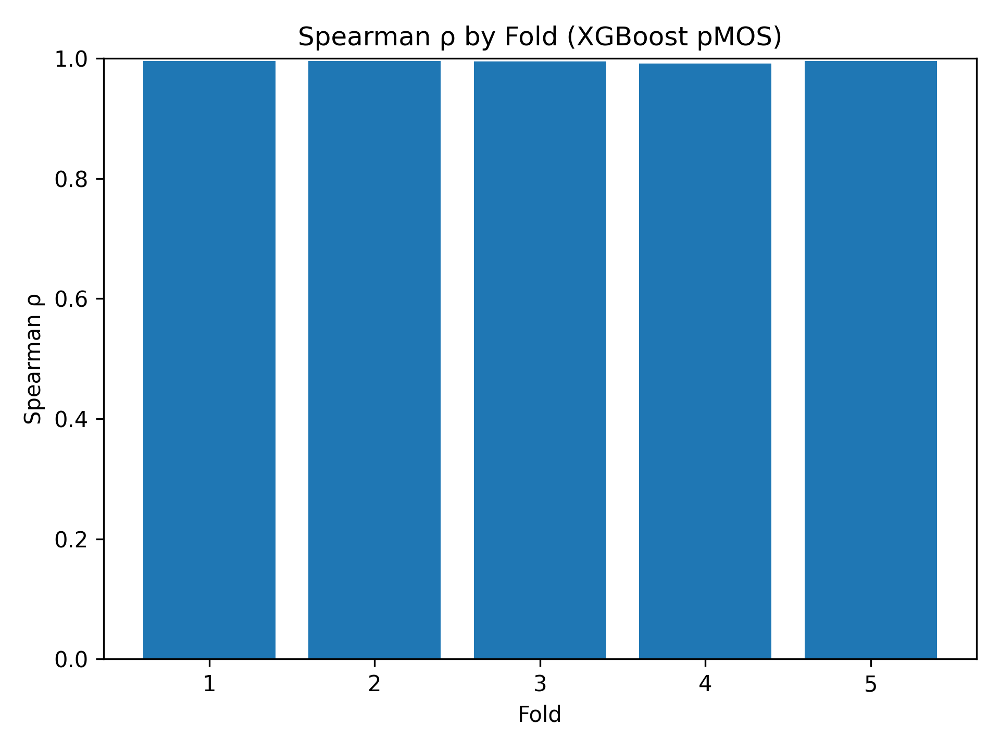
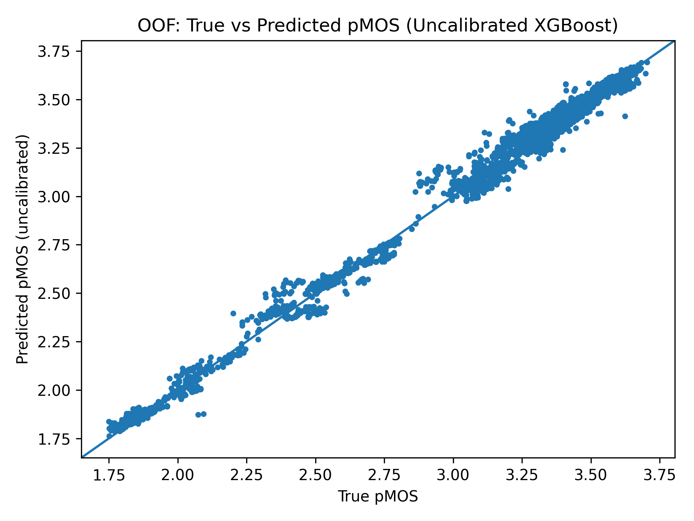
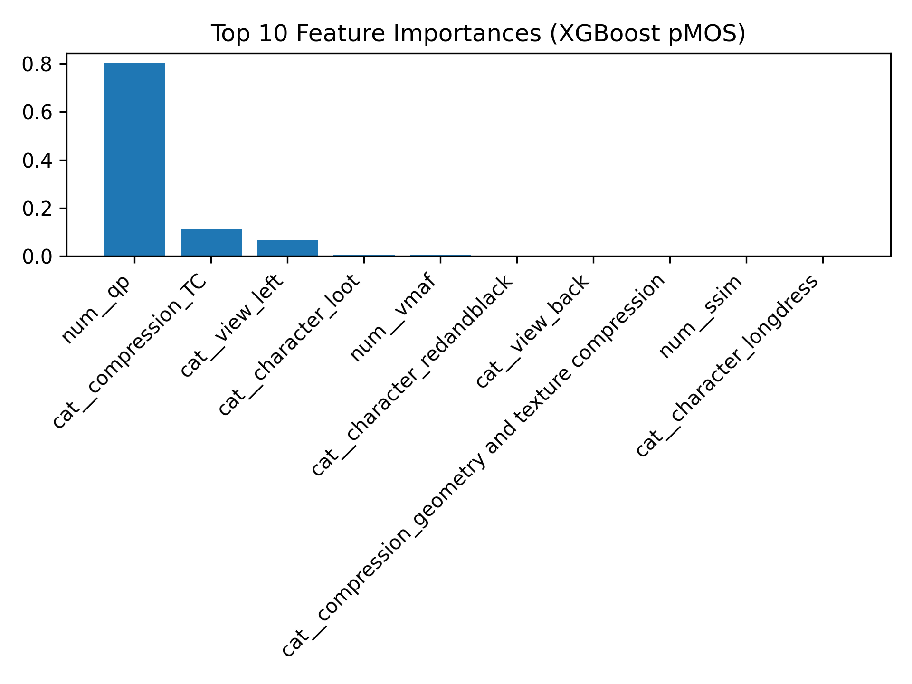
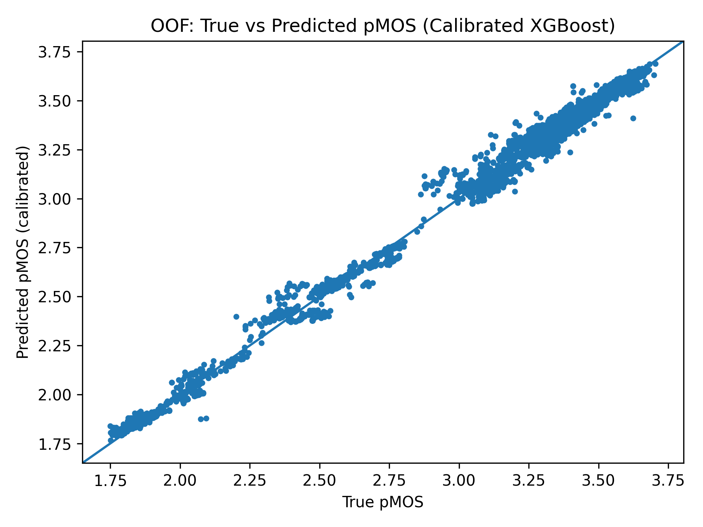
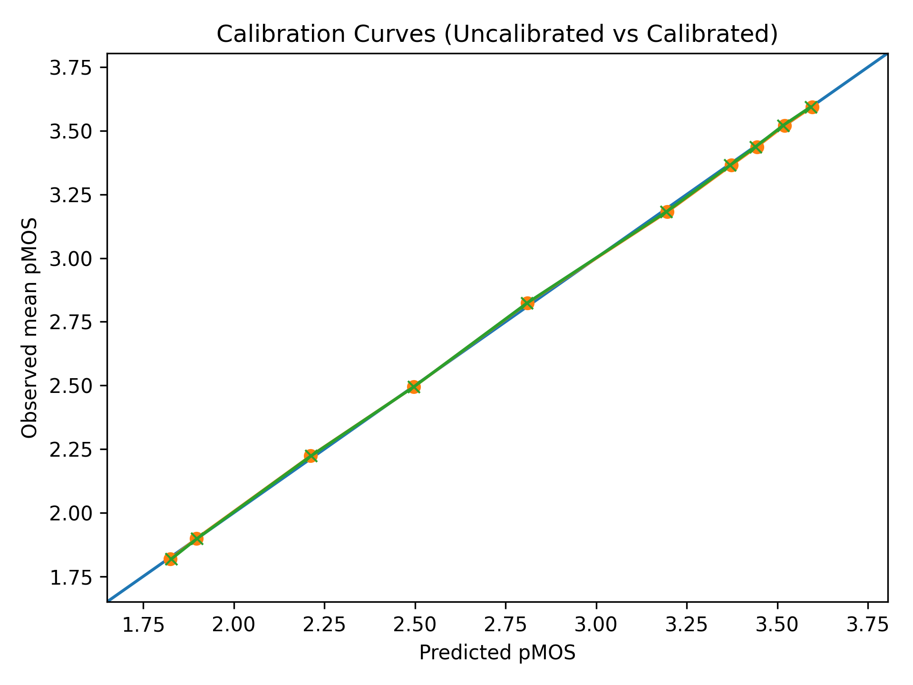

# XGBoost pMOS Model (8,448 Volumetric Videos)

This repository documents an **XGBoost regression model** trained on the full catalogue of **8,448 volumetric videos** for **predicted Mean Opinion Score (pMOS)** estimation. The aim here is not to claim human perception has been “solved”, but to provide a **numerically consistent, feature-space aligned predictor** across compression levels, characters, and viewpoints. All results are reported on the **1–5 pMOS scale**, where errors (RMSE, MAE) and correlations (Pearson, Spearman) reflect **regression consistency** rather than direct subjective quality assessment. 

## Table of Contents
- [Methodology](#methodology)
  - [Dataset and Features](#dataset-and-features)
  - [How pMOS Was Obtained](#how-pmos-was-obtained)
  - [Model Design](#model-design)
- [Evaluation Protocol](#evaluation-protocol)
- [Results](#results)
  - [Fold-wise Performance](#fold-wise-performance)
  - [Overall Results](#overall-results)
  - [Calibration and Confidence Interval Analysis](#calibration-and-confidence-interval-analysis)
- [Visualisations](#visualisations)
- [Analysis](#analysis)
- [Limitations and Next Steps](#limitations-and-next-steps)
- [Reproducibility and Artifacts](#reproducibility-and-artifacts)

## Methodology

### Dataset and Features

The dataset used is `all_8448_with_pMOS.xlsx`, containing volumetric video metadata, compression settings, and pMOS values.

**Input features:**

| Type | Features |
|---|---|
| Categorical | `character`, `view`, `compression` |
| Numerical | `qp`, `qp²`, `vmaf`, `ssim`, `psnr` |

The addition of **qp²** (quantization parameter squared) captures the **non-linear** effect of compression on perceived quality.

**Preprocessing steps:**
- Lowercasing column names  
- Type conversion to numeric (for QP, VMAF, SSIM, PSNR, and pMOS)  
- Global NaN removal (`df.dropna().reset_index(drop=True)`)  

After preprocessing, **8,448 valid samples** remained. 

### How pMOS Was Obtained

The pMOS values used in this work were generated in two stages: **real human subjective ratings** followed by **model-based generalisation**.

1) **Subjective experiment (ground truth MOS for the base set):**  
A controlled subjective experiment was conducted on the base set of **240 volumetric videos**, with each video being viewed, in a view-and-rate format, multiple times by different human subjects, following the **ITU-T P.910** recommendations on conducting subjective tests. Individual opinion scores were cleaned using standard outlier-rejection procedures and the remaining valid responses averaged to yield a reliable **Mean Opinion Score (MOS)** on the **1–5 quality scale**. These are its only part of the dataset that contain data from genuine human quality judgements.

2) **Model-based extension to the full catalogue:**  
The second stage was to take these **240 MOS labelled videos** and train a neural regression model (**EfficientNet-B3**). This model learns to predict subjective quality from objective and metadata-based features. Once trained, it was then applied to the full collection of **8,448 compressed video versions**, again with all four QP levels (15, 25, 35, 45) and with all compression types. Since human MOS existed only for the original 240 videos, the other ~97% of the dataset needed model-based estimation. The predicted scores produced from this model become the **pMOS values** used in the XGBoost regression study. pMOS thus allows extension of the subjective scale for all compression settings, firmly anchored to real human judgements. 

### Model Design

The final model uses **XGBoost** (`tree_method='hist'`), selected for stability, explainability, and strong handling of non-linear relationships. The pipeline includes preprocessing via a **Column Transformer** for one-hot encoding of categorical columns and passthrough of numerical columns.

**Final configuration:**

| Parameter | Value |
|---|---:|
| `learning_rate` | 0.09 |
| `max_depth` | 4 |
| `min_child_weight` | 5 |
| `n_estimators` | 300 |
| `subsample` | 0.7 |
| `colsample_bytree` | 1.0 |
| `reg_lambda` | 5.0 |
| `random_state` | 42 |
| `objective` | `reg:squarederror` |

Reproducibility is supported by fixing `random_state=42` and using deterministic **GroupKFold** splits. 

## Evaluation Protocol

### Cross-Validation
**GroupKFold (n_splits=5)** is used, grouping by **(character + view)** to prevent overlap between folds of similar viewpoints of the same character. Each fold acts as an unseen test set, enabling fair **Out-of-Fold (OOF)** evaluation. 

### Metrics
All metrics are reported on the **1–5 pMOS scale**:
- **R²** (Coefficient of Determination)  
- **RMSE** (Root Mean Square Error)  
- **MAE** (Mean Absolute Error)  
- **Pearson r** (linear correlation coefficient)  
- **Spearman ρ** (rank correlation) 

## Results

### Fold-wise Performance

| Fold | R² | RMSE | MAE | Pearson r | Spearman ρ |
|---:|---:|---:|---:|---:|---:|
| 1 | 0.9953 | 0.0459 | 0.0283 | 0.9977 | 0.9960 |
| 2 | 0.9965 | 0.0372 | 0.0251 | 0.9983 | 0.9955 |
| 3 | 0.9977 | 0.0327 | 0.0180 | 0.9990 | 0.9948 |
| 4 | 0.9951 | 0.0456 | 0.0340 | 0.9977 | 0.9917 |
| 5 | 0.9959 | 0.0408 | 0.0290 | 0.9980 | 0.9960 |

### Overall Results

**Overall Results (OOF):**

| Metric | Value |
|---|---:|
| R² | 0.9961 |
| RMSE | 0.0411 |
| MAE | 0.0270 |
| Pearson r | 0.9980 |
| Spearman ρ | 0.9952 |
| R² mean ± std | 0.9961 ± 0.0010 |

These results indicate near-perfect alignment between predicted and true pMOS values. Errors are within ±0.04 on a 1–5 scale, and consistency holds across all folds. 

### Calibration and Confidence Interval Analysis

A simple **linear calibration** is applied on the **OOF predictions** to verify alignment with the pMOS scale. This correction is intentionally light-weight, adjusting tiny global bias while preserving ranking and relative structure.

**Before vs after calibration:**

| Metric | Before Calibration | After Calibration |
|---|---:|---:|
| R² | 0.9961 | 0.9961 |
| RMSE | 0.0411 | 0.0410 |
| PLCC | 0.9980 | 0.9980 |
| SRCC | 0.9952 | 0.9952 |

The numerical change is intentionally minor, indicating the model was already well aligned and calibration simply fine-tunes the scale.

**95% bootstrap confidence intervals (2,000 resamples) on calibrated predictions:**

| Metric | 95% Confidence Interval (Bootstrap) |
|---|---|
| R² | 0.9958 – 0.9963 |
| PLCC | 0.9979 – 0.9982 |
| SRCC | 0.9948 – 0.9955 |

These tight intervals support stability across resamples. 

## Visualisations

- **Figure 1:** R² by Fold  
   
  

- **Figure 2:** RMSE by Fold  
  
  

- **Figure 3:** Fold-wise Pearson Correlation  
  
  

- **Figure 4:** Fold-wise Spearman Correlation  
  
  

- **Figure 5:** OOF Scatter Plot (predicted vs true pMOS)  
  
  

- **Figure 6:** Top Ten Most Influential Features  

  

- **Figure 7:** Uncalibrated Scatter  

  

- **Figure 8:** Calibrated Scatter  
 
  

- **Figure 9:** Calibration Curves (uncalibrated vs calibrated)  

  

## Analysis

The model explains **99.61%** of the variance in pMOS, suggesting that volumetric video quality (as represented through objective metrics such as VMAF, SSIM, and PSNR) is captured effectively by the feature set.

Key points reported:
- VMAF, SSIM, and QP dominate feature importance, consistent with compression-driven perceptual change.
- Low RMSE and MAE indicate minimal deviation between predictions and target.
- Inter-fold R² variance (±0.0010) indicates stable generalisation.
- OOF scatter indicates absence of systemic bias, with predictions clustering around the y=x diagonal.
- QP and QP² show an inverse, nonlinear relationship with pMOS.
- Compression type contributes modestly but consistently, refining calibration per encoder type. 
